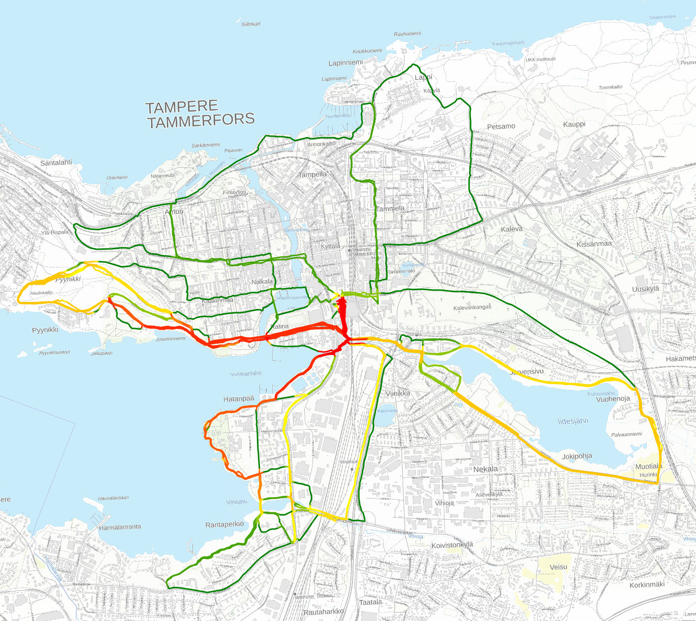

# map-plotter-folium

A tool for plotting GPX files on a map with heatmap-like coloring.
Track segments which are close to other tracks are drawn with increasingly
warmer colors.

An HTML file with an interactive map is generated with Folium.

The tool assumes the tracks are located in Finland and uses a Finnish base map.
To plot on other areas of the world, change the cartesian coordinate system transformation
and the map tile url.

## Example

`uv run plot.py ~/directory/of/tracks/*.GPX --output yearly_runs.html`

